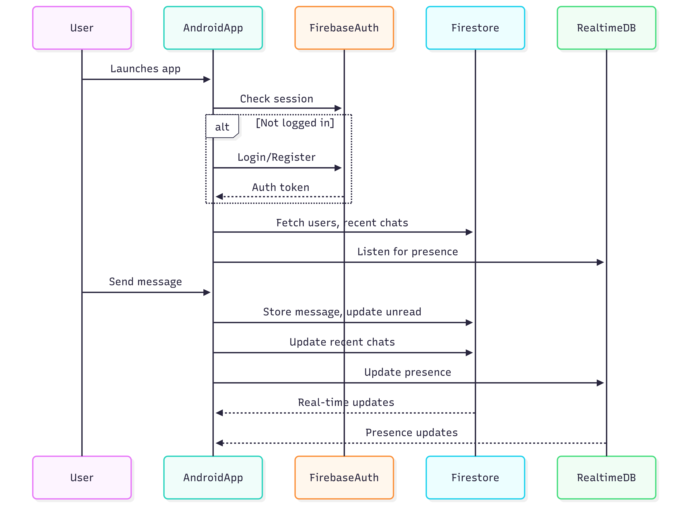
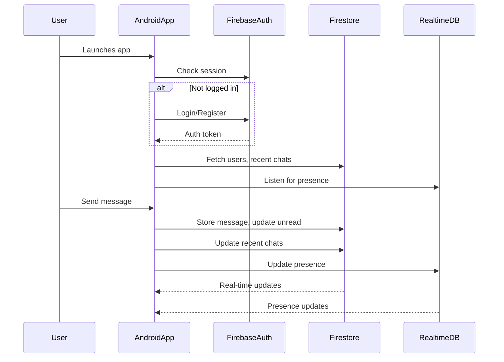
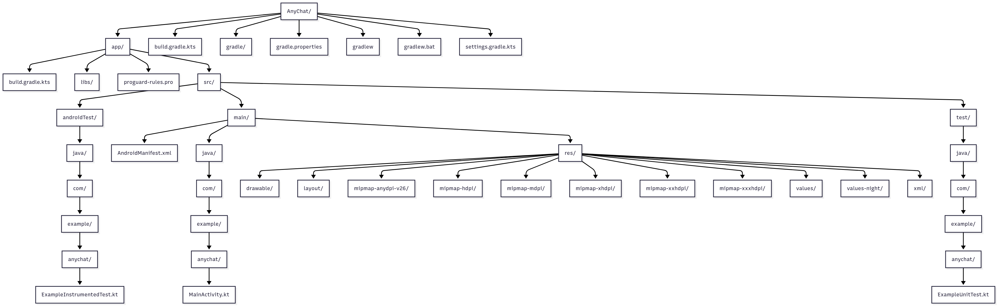

# AnyChat

## Project Overview
AnyChat is a modern, real-time chat application for Android built with Kotlin, MVVM architecture, and Firebase. It supports user authentication, 1-to-1 messaging, presence, unread message counts, and a polished, professional UI. The app is designed for scalability, security, and a seamless user experience.

## Project Status
- **Status:** 🚀 In Development / MVP Complete
- **Core features implemented:** Authentication, user list, real-time chat, unread counts, session management, splash screen, and polished UI.
- **Actively maintained:** Yes

## Architecture Overview
- **Pattern:** MVVM (Model-View-ViewModel)
- **Backend:** Firebase (Auth, Firestore, Realtime Database)
- **UI:** Material Design, modern Android best practices
- **Session:** Persistent until explicit logout

## System Architecture Diagram



<details>
<summary>Mermaid Source (edit/copy)</summary>


</details>

## Technology Stack
- **Language:** Kotlin
- **Architecture:** MVVM
- **Backend:** Firebase (Auth, Firestore, Realtime Database)
- **UI:** Android XML, Material Components
- **Other:** ViewModel, LiveData, RecyclerView, CardView

## Core Features
- **Authentication:** Email/password registration & login (Firebase Auth)
- **User List:** All registered users, sorted by recent chat activity
- **Presence:** Online/offline status in real time (Firebase Realtime DB)
- **Chat:** 1-to-1 real-time messaging (Firestore)
- **Unread Count:** Accurate, scalable unread badge per chat
- **Session:** Persistent login, splash screen, logout
- **UI:** Modern, branded, animated, and responsive
- **Security:** Firebase rules, session checks, input validation

## Project Structure

### Overview

Below is a visual representation of the current project structure. This helps you quickly understand the organization of the codebase.

#### Project Structure Diagram

<!-- Rendered Mermaid diagram image (exported from Mermaid Live Editor or similar) -->
<p align="center">
  
</p>

> **Tip:** To update the image, copy the Mermaid code above into the [Mermaid Live Editor](https://mermaid.live/) and export as PNG to `docs/project-structure.png`.

## Quick Start
1. **Clone the repo:**
   ```bash
   git clone <repo-url>
   ```
2. **Open in Android Studio.**
3. **Add your `google-services.json` to `app/`.**
4. **Enable Email/Password Auth in Firebase Console.**
5. **Create Firestore & Realtime Database (test mode for dev).**
6. **Build & run on device/emulator.**

## Real-time Features
- **User presence:** Updates instantly as users go online/offline.
- **Chat:** Messages and unread counts update in real time.
- **User list:** Sorted by last message, with live unread badge.

## Testing
- **Unit tests:** Add in `test/` and `androidTest/` directories.
- **Manual testing:**
  - Register/login/logout flows
  - Send/receive messages
  - Unread badge and presence
  - Session persistence

## Performance & Monitoring
- **Efficient listeners:** Only active for visible screens.
- **Firestore rules:** Secure and optimized for chat use case.
- **Crashlytics:** (Optional) Add for production monitoring.

## Security Features
- **Session checks:** All screens redirect if not authenticated.
- **Input validation:** On all forms.
- **Firebase rules:** Restrict read/write to authenticated users.
- **No sensitive data stored on device.**

## Future Enhancements
- Group chats
- Push notifications (FCM)
- User profile pictures
- Typing indicators
- Message reactions
- Media/file sharing
- Dark mode
- In-app settings
- Better accessibility

## Additional Info
- **Branding:** Replace `ic_logo` with your own logo for a custom look.
- **Adaptive icons:** Recommended for best appearance on all devices.
- **Contributions:** PRs and issues welcome!
- **License:** MIT (or your choice)

---

**Built with ❤️ using Kotlin, Firebase, and Android best practices.** 